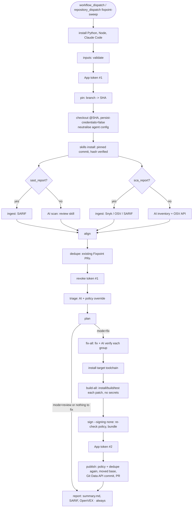

# Fixpoint architecture

Fixpoint reviews a target repository out of band, fixes what it can prove, and raises pull requests.
It lives in its own repo; target repos get no workflow files and no changes other than Fixpoint's PRs.

## Flow

The POC runs as **one job** in `.github/workflows/fixpoint.yml`. Each box is one or more steps; each step is
one `fixpoint <command>` reading and writing JSON under `work/`.

## Steps and what they can see

| Step | AI | Runs target code | Token in env | Model key in env |
|---|---|---|---|---|
| inputs, pin, checkout, neutralise, skills | no | no | token #1 (pin, checkout) | no |
| SAST / SCA AI scan | yes | no | no | yes |
| ingest, align | no | no | no | no |
| dedupe | no | no | token #1 | no |
| revoke token #1 | no | no | token #1 (to revoke it) | no |
| triage, fix-all | yes | no (agent has no shell) | no | yes |
| toolchain setup, build-all | no | **yes** | no | no |
| sign (bundle), publish | no | no | token #2 (publish only) | no |
| report | no | no | no | no |

`GITHUB_TOKEN` has `contents: read` only (to check out this repo) and is never used on the target. No PATs.
The earlier split multi-job design (per-job isolation, cosign-signed handoff, protected publish
environment) is in git history at commit `70a5ec0` for when this graduates from POC.

## Trust boundaries

1. **Target repo → agent.** The repo is untrusted input. Before any agent runs, agent config is deleted
   (`.claude/`, `CLAUDE.md`, `AGENTS.md`, `.cursor*`, `.github/copilot-instructions.md`, `.mcp.json`, and
   similar), symlinks that leave the repo are removed, git hooks are disabled. The agent runs with a private
   `HOME` containing only Fixpoint's skills, `--setting-sources user`, `--strict-mcp-config` (no MCP servers),
   `--permission-mode dontAsk`, `--tools` restricted per role, deny rules for secrets/CI files, a guardrail
   system prompt, and every repo/finding excerpt wrapped in `<untrusted-data>` tags. Its environment is
   scrubbed: no GitHub tokens, no `ACTIONS_ID_TOKEN_REQUEST_*`.
2. **Agent → pipeline.** Model output is structured (`--json-schema`), validated again in Python, and never
   executed. File paths are normalised and confined to the repo; SCA versions from the inventory must appear
   verbatim in the manifest; CVEs and fixed versions come only from OSV or a scanner report.
3. **Target code → runner.** Only the `build-all` step executes target code. Its environment has no secrets,
   the checkout token has already been revoked, and the publish token does not exist yet. (POC caveat: it is
   the same VM as the earlier AI steps.)
4. **Fix → publish.** Publish takes the byte-exact patch whose hash both verdicts recorded, re-checks the
   bundle belongs to this run/repo/branch/SHA, then re-applies policy and dedupe against live GitHub.
5. **PR body.** Model/scanner text is HTML-escaped, `@mentions` are defused, and the hidden markers are
   parsed from the last occurrence only, so markers smuggled into quoted content are ignored.

Policy is enforced three times: **plan** (eligibility), **verify + sign** (diff rules on the exact bytes),
**publish** (diff rules, enrolment, autonomy, dedupe, PR limits against live state).

## Skills

The pinned pack is `basusaswata/SecCodeAndRevAgent` (AISecCore). It is fetched at the commit in `skills.lock`,
its content hash is verified, and it is installed into the agent's private `~/.claude/skills/<id>/SKILL.md`
(the raw pack is also available read-only at `~/.claude/fixpoint-skills`). The pack contains one review
procedure (`scgra-reviewer`) plus 24 topic skills (`scgra-0-*`, `scgra-1-*`); there are no separate triage /
remediation / verify skills, so each role is driven by a Fixpoint prompt template (`fixpoint/prompts/`) that loads the
role's skill and the topic skill named in the finding:

| Role | Skill (skills.lock) | Prompt |
|---|---|---|
| review (DISCOVER SAST) | `scgra-reviewer` | `fixpoint/prompts/discover-sast.md` |
| discover_sca (inventory) | `scgra-0-supply-chain-security` | `fixpoint/prompts/discover-sca.md` |
| triage | `scgra-reviewer` | `fixpoint/prompts/triage.md` |
| fix_cwe | `scgra-0-cwe-prevention` | `fixpoint/prompts/fix-cwe.md` |
| fix_cve | `scgra-0-supply-chain-security` | `fixpoint/prompts/fix-cve.md` |
| verify | `scgra-reviewer` | `fixpoint/prompts/verify.md` |

When dedicated skills ship, change the names in `skills.lock`; nothing else changes.

## Common finding format

Defined in `fixpoint/model.py`. Every stage reads and writes
`{"schema": "fixpoint/findings/v1", "meta": {...}, "findings": [...]}`.

| Field | Set by | Meaning |
|---|---|---|
| `id` | ingest/discover | stable fingerprint. SAST: `sast-` + sha256(CWEs, file, normalised snippet). SCA: `sca-` + sha256(ecosystem, package, version, CVEs). Independent of line numbers, scanner and wording |
| `kind` | ingest/discover | `sast` or `sca` |
| `source` | ingest/discover | `report:<scanner>` or `discover:<skill>` |
| `rule_id`, `title`, `message` | ingest/discover | scanner rule / AISecCore skill id, text |
| `severity` | ingest/discover | `critical`, `high`, `medium`, `low`, `info` |
| `cwe[]`, `cve[]` | ingest/discover | normalised `CWE-89`, `CVE-2020-14343` |
| `location` | ingest/discover, align | `file`, `start_line`, `end_line`, `snippet` (align updates lines) |
| `package` | ingest/discover | `ecosystem`, `name`, `version`, `fixed_versions[]`, `manifest` |
| `path[]` | ingest/discover | source-to-sink steps |
| `status` | align, dedupe | `open`, `stale`, `unlocatable`, `in_flight`, `fixed`, `rejected` |
| `disposition` | triage | `fix`, `false_positive`, `not_reachable`, `accepted_risk`, `human_review` |
| `confidence`, `reasoning`, `evidence[]` | triage | evidence items: `kind` (`source_to_sink`, `reachability`, `code`, `advisory`, `note`), `description`, `file`, `line` |
| `notes[]`, `properties{}` | any | audit notes (e.g. policy overrides), extra data (`osv_confirmed`, `pr`, ...) |

Other documents: `plan.json` (`fixpoint/plan/v1`: groups + deferred), `fix/<group>/{patch.diff,meta.json}`,
`verdicts/<group>.<phase>.verdict.json`, `signed/<group>.bundle.json` + `.sigstore.json`, `publish.json`.

## Idempotency and state

GitHub is the only state store. Every PR body ends with
`<!-- fixpoint-findings: id1,id2 -->` and a base64 metadata block; the head branch is
`fixpoint/<branch-slug>/<group-id>`. Group ids are derived from finding ids, so re-running the same inputs
produces the same groups; dedupe (prepare) and the live re-check (publish) turn them into `in_flight` and skip.
Closed-unmerged PRs mark their findings `rejected` on every branch, forever.

## Fail-safe rules

| Situation | Result |
|---|---|
| triage call fails / answer missing / invalid JSON | whole batch → `human_review` |
| `fix` below confidence or severity threshold | `human_review` |
| SCA with no known fixed version, or discovered SCA not confirmed by OSV | `human_review` |
| no fixed version within the branch's upgrade strategy | deferred |
| agent `cannot_fix`, empty diff, forbidden path, size, test deletion/weakening, missing test | no bundle |
| no build marker (with `require_build`) or build/test fails | no bundle |
| verify skill: finding still present, new issue, weak test, low confidence | no bundle |
| OSV re-scan: vuln still present, new vuln, OSV unreachable | no bundle |
| signature invalid, bundle from another run, policy/dedupe fails at publish | skipped, reported |
| base moved and patch does not apply | skipped as `conflict`, reported |
